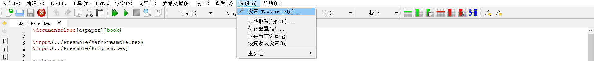
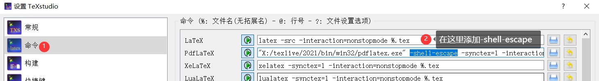
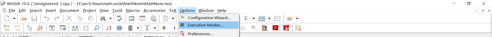
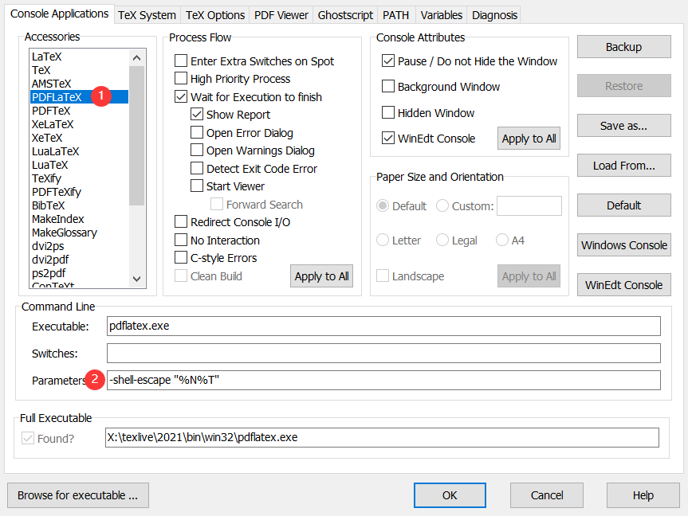

# 数学笔记

这是我的个人数学笔记, 里面的题目大多来源于书籍与互联网, 解题方法有些是我本人提供的, 有些则来自网络.

可能存在的问题欢迎大家提交issue告知.

关于解答详细程度的说明: 

1. 我们都知道学习数学重在思考, 我不是一个喜欢伸手党的人. 
2. latex编写数学公式是一件比较耗时的工作, 虽然我认为LyX已经很好的加快了我的编码速度.
3. 笔记写的太过详细就不是个人笔记了, 会导致`我本人`阅读到冗余信息, 所以所有的题目解答都是以`比提示稍微丰富一点`的方式展示关键过程.

关于源代码的编译的说明:

这个模板为个人通过`tcolorbox`文档自定义的, 需要pygments的python库, 你可以在[这里](http://pygments.org/languages/)参考下载, 或者参考[这里的代码](https://pypi.org/project/Pygments/)通过pip安装. 以为这个包的引入, 编译的时候需要对编译器添加额外的参数: `-shell-escape`, 以下是各个常见的编辑器中对编译器的相关配置说明.

Makefile直接编译:

笔记中`MathNote`文件夹内给了一个简单的`Makefile`, 在Linux中配置好`make`工具的, 直接在目录`MathNote`下执行`make`即可编译, emm, 可能pdf阅读器部分需要改改... 比如用`evince`.

texlive编辑器中的配置:

CTeX的WinEdt编辑器中的配置:

